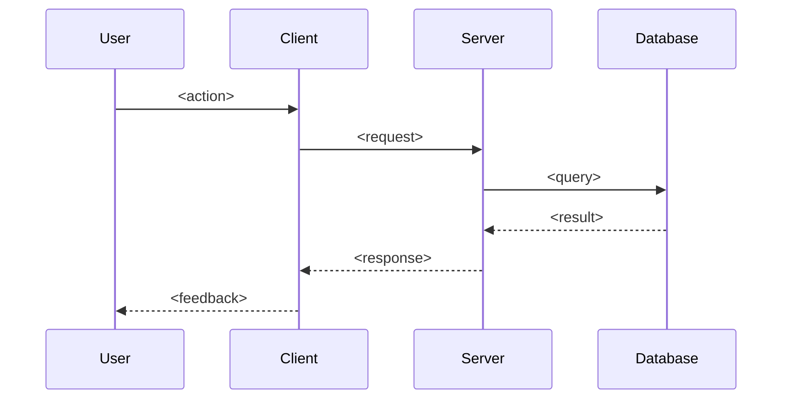
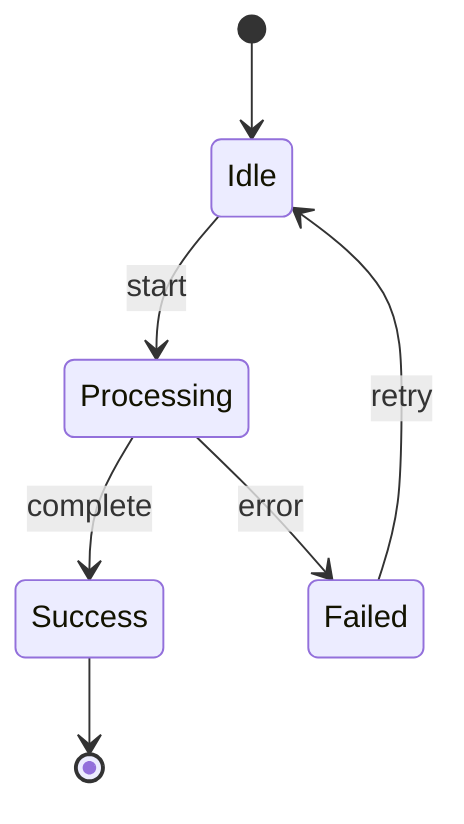

# Documentation Templates

## Master Index

`docs/INDEX.md` — The entry point for all project documentation.

```markdown
# {Project Name} Documentation

<one paragraph description of the project: what it is, who it's for, core value proposition>

## Tech Stack

- **Framework**: <e.g., Phoenix/Elixir, Next.js, Unity>
- **Database**: <e.g., PostgreSQL, Redis>
- **Hosting**: <e.g., Fly.io, Vercel, AWS>

## Features

| Feature | Description |
|---------|-------------|
| [<feature-name>](features/feature-name/INDEX.md) | <brief one-line description> |

## Quick Links

- [Architecture Overview](architecture/OVERVIEW.md) *(if exists)*
- [Getting Started](GETTING_STARTED.md) *(if exists)*
```

---

## Feature Index

`docs/features/{feature-name}/INDEX.md` — Table of contents for a feature folder.

```markdown
# {Feature Name}

<one paragraph summary: what this feature does and why it exists>

## Documents

| Document | Purpose |
|----------|---------|
| [DESIGN.md](DESIGN.md) | Components, user flows, design decisions |
| [TECHNICAL.md](TECHNICAL.md) | Implementation details, data models, APIs |
| [FLOW.mermaid](FLOW.mermaid) | <description of what the diagram shows> |
| [<topic>.md](<topic>.md) | <description of sub-component> |

## Last Updated

<YYYY-MM-DD>
```

---

## Design Specification

`docs/features/{feature-name}/DESIGN.md` — The what and why.

```markdown
# {Feature Name} — Design

## Overview

<what does this feature do? one paragraph>

## Components

### <Component Name>

<description of this component and its responsibility>

## User Flows

### <Flow Name>

<describe the main flow: screens, user interactions, what happens step by step>

## Design Decisions

*Document key decisions as they are made.*
```

---

## Technical Specification

`docs/features/{feature-name}/TECHNICAL.md` — The how.

```markdown
# {Feature Name} — Technical

## Architecture

<how does this feature fit into the overall system? key components involved>

## Data Model

<tables, schemas, or data structures - use code blocks for schemas>

```elixir
# Example schema
schema "users" do
  field :email, :string
  field :role, :string
  timestamps()
end
```

## API / Interfaces

<endpoints, function signatures, or module interfaces>

### `<endpoint or function>`

- **Input**: <params>
- **Output**: <response>
- **Side effects**: <if any>

## Implementation Notes

<key implementation details, gotchas, performance considerations>

## Dependencies

- <internal module or external service this feature depends on>
```

---

## Flow Diagram

`docs/features/{feature-name}/FLOW.mermaid` — Visual representation of flows.



Alternative for state machines:



---

## Changelog

`docs/features/{feature-name}/CHANGELOG.md` — Feature-specific history.

```markdown
# {Feature Name} — Changelog

## <YYYY-MM-DD>

### Added
- <new capability>

### Changed
- <modification to existing behavior>

### Fixed
- <bug fix>

## <YYYY-MM-DD>

### Added
- Initial implementation
```

---

## Sub-Component Document

`docs/features/{feature-name}/{topic}.md` — Isolated documentation for complex sub-systems.

```markdown
# {Feature Name} — {Topic}

## Overview

<what is this sub-component and why is it documented separately?>

## Design

<design decisions specific to this sub-component>

## Technical Details

<implementation specifics>

## Integration

<how this sub-component connects to the parent feature>
```

---

## Archived Plan

`docs/plans/{feature-name}/{YYYY-MM-DD}-{description}.md` — Preserved implementation plan.

Plans are archived as-is after approval. Do not modify after archiving.

```markdown
# {Feature Name} — Plan: {Description}

**Date**: <YYYY-MM-DD>
**Status**: <Approved / Implemented / Deferred>

## Context

<why this plan was created - what problem it solves>

## Plan

<the implementation plan as approved - may be copied directly from the planning conversation>

## Notes

<any additional context, constraints, or decisions made during planning>
```
