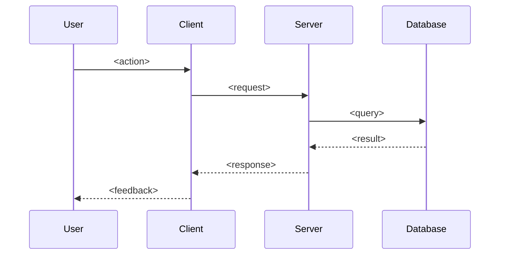
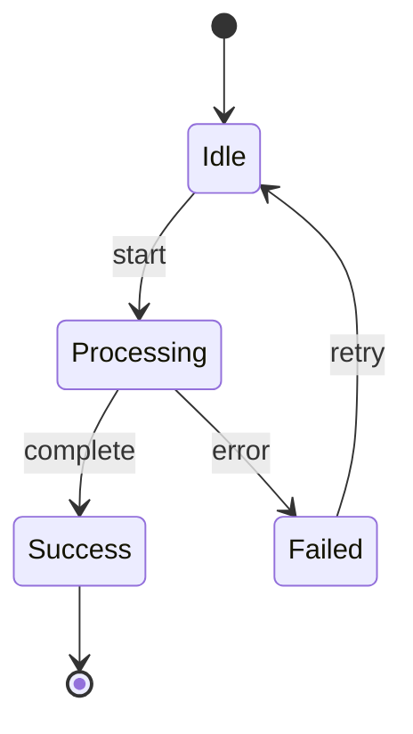

# Documentation Templates

## Master Index

`docs/INDEX.md` — entry point for all project documentation.

```markdown
# {Project Name} Documentation

<one paragraph description of the project: what it is, who it's for, core value proposition>

## Tech Stack

- **Framework**: <e.g., Phoenix/Elixir, Next.js, Unity>
- **Database**: <e.g., PostgreSQL, Redis> if relevant
- **Hosting**: <e.g., Fly.io, Vercel, AWS> if relevant
- **Other**: any relevant architectural or infrastructure notes

## Features

| Feature | Description |
|---------|-------------|
| [<feature-name>](features/feature-name/INDEX.md) | <brief one-line description> |

## Quick Links

- [CONTEXT.md](CONTEXT.md) — Ubiquitous language / project glossary
- [Getting Started](../README.md) *(if exists)*
- [Testing](testing.md) *(if exists)*
- [Architecture Overview](architecture/OVERVIEW.md) *(if exists)*
```

---

## Feature Index

`docs/features/{feature-name}/INDEX.md` — table of contents for a feature folder.

```markdown
# {Feature Name}

<one paragraph summary: what this feature does and why it exists>

## Documents

| Document | Purpose |
|----------|---------|
| [DESIGN.md](DESIGN.md) | Components, user flows, design decisions |
| [TECHNICAL.md](TECHNICAL.md) | Architecture, source files, noteworthy behavior |
| [CONTEXT.md](CONTEXT.md) | Feature-specific terms (only if this feature has local-only language) *(if exists)* |
| [FLOW.mermaid](FLOW.mermaid) | <description of what the diagram shows> *(if exists)* |
| [<topic>.md](<topic>.md) | <description of sub-component> *(if exists)* |
```

---

## Project Context

`docs/CONTEXT.md` — the project's ubiquitous language.

```markdown
# {Project Name} — Context

<one or two sentences: what this glossary covers and why it exists.>

## Language

**Order**:
A confirmed customer request for goods or services.
_Avoid_: Purchase, transaction

**Invoice**:
A request for payment sent to a customer after delivery.
_Avoid_: Bill, payment request

**Customer**:
A person or organization that places orders.
_Avoid_: Client, buyer, account

## Relationships

- An **Order** produces one or more **Invoices**
- An **Invoice** belongs to exactly one **Customer**

## Example dialogue

> **Dev:** "When a **Customer** places an **Order**, do we create the **Invoice** immediately?"
> **Domain expert:** "No — an **Invoice** is only generated once a **Fulfillment** is confirmed."

## Flagged ambiguities

- "account" was used to mean both **Customer** and **User** — resolved: these are distinct concepts.
```

---

## Feature Context

`docs/features/{feature-name}/CONTEXT.md` — **optional.** Only create when a feature has terms that are strictly local to it. Most terms belong in the project-level `docs/CONTEXT.md`.

```markdown
# {Feature Name} — Context

<one or two sentences: what this feature-local glossary covers and why these terms didn't go into the project-level CONTEXT.md.>

## Language

**<Term>**:
<one-sentence definition>
_Avoid_: <aliases or near-synonyms not to use>

## Relationships

- ...

## Example dialogue

> ...

## Flagged ambiguities

- ...
```

If a term here is also used outside the feature, **promote it to `docs/CONTEXT.md`** and remove it here.

---

## Design Specification

`docs/features/{feature-name}/DESIGN.md` — the what and why (UX-level, not implementation).

```markdown
# {Feature Name} — Design

## Overview

<what does this feature do? one paragraph>

## Components

### <Component Name>

<description of this component and its responsibility — visible UX, not code structure>

## User Flows

### <Flow Name>

<describe the main flow: screens, user interactions, what happens step by step>

## Design Decisions

*Document key decisions as they are made — the "why", not the "how".*
```

---

## Technical Specification

`docs/features/{feature-name}/TECHNICAL.md` — the how. Point at the code, don't paraphrase it.

```markdown
# {Feature Name} — Technical

## Architecture

<one short paragraph: how the feature is wired end to end — which layer handles what,
how data flows from client to persistence (or vice versa). Call out scope/ownership
enforcement if relevant.>

## Source Files

| File | Role |
|------|------|
| `lib/my_app/foo.ex` | <one-line role — e.g. "context: CRUD + scope-filtered queries">|
| `lib/my_app_web/live/foo_live.ex` | <one-line role — e.g. "LiveView: mount + events">|
| `assets/js/hooks/foo_hook.js` | <one-line role — e.g. "client hook: drag + optimistic UI">|

*One line per file. Do not list the functions inside each file.*

## Data Model

<include schema code blocks ONLY if the persisted shape is non-obvious or load-bearing.
Skip field-by-field prose — the schema block is authoritative. Note unusual indexes,
constraints, or nullable semantics if they matter.>

## Noteworthy Behavior

<The point of this doc. Bullet or short-section the things a reader CAN'T learn by
reading the code: performance paths, race-condition handling, cascade algorithms,
optimistic-UI contracts, migration quirks, "why does this handler deliberately skip
re-streaming", etc. Keep each item to 1-4 sentences. If there's nothing non-obvious,
this section is legitimately short or absent.>

## Dependencies

- <internal module or external service this feature depends on — short bullet list>
```

---

## Flow Diagram

`docs/features/{feature-name}/FLOW.mermaid` — visual representation of flows.



Alternative for state machines:



---

## Sub-Component Document

`docs/features/{feature-name}/{topic}.md` — isolated documentation for complex sub-systems. Use when a topic clutters TECHNICAL.md and is only relevant for specific tasks.

```markdown
# {Feature Name} — {Topic}

## Overview

<what is this sub-component and why is it documented separately?>

## Design

<design decisions specific to this sub-component>

## Technical Details

<implementation specifics — same rules as TECHNICAL.md: point at files, don't paraphrase>

## Integration

<how this sub-component connects to the parent feature>
```
