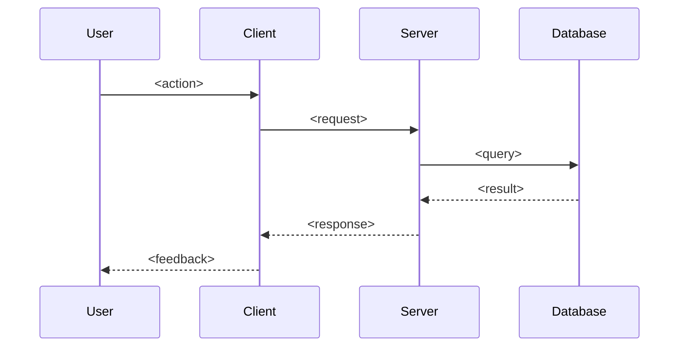
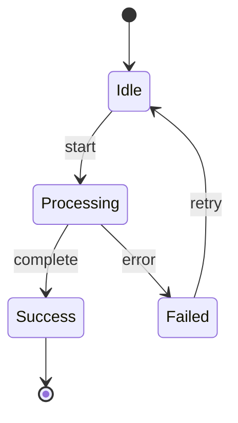

# Documentation Templates

> **What NOT to include, anywhere:**
> - Per-function signatures or Input/Output/Side-effects bullets — readers open the source file.
> - Per-event / per-assign / per-attribute tables that mirror what the template or LiveView already defines.
> - Field-by-field prose re-listing every column in a schema block.
> - Test lists (individual test cases) or dev-tool walk-throughs in any INDEX.md.
> - Timestamps, "last updated" dates, or author info.
>
> **What to include in TECHNICAL.md**: architecture, what each source file is for, noteworthy / non-obvious behavior, dependencies. That's it. If a fact is visible by reading the code, don't restate it.

---

## Master Index

`docs/INDEX.md` — The entry point for all project documentation. Keep it strictly to description + tech stack + features table + quick links. No inline test run-books, no dev-tool walk-throughs — those belong in their own docs and get linked under Quick Links.

```markdown
# {Project Name} Documentation

<one paragraph description of the project: what it is, who it's for, core value proposition>

## Tech Stack

- **Framework**: <e.g., Phoenix/Elixir, Next.js, Unity>
- **Database**: <e.g., PostgreSQL, Redis> if relevant
- **Hosting**: <e.g., Fly.io, Vercel, AWS> if relevant
- **Other**: any relevant architectural or infrastructure notes

## Features

| Feature | Description |
|---------|-------------|
| [<feature-name>](features/feature-name/INDEX.md) | <brief one-line description> |

## Quick Links

- [Getting Started](../README.md) *(if exists)*
- [Testing](testing.md) *(if exists)*
- [Architecture Overview](architecture/OVERVIEW.md) *(if exists)*
```

---

## Feature Index

`docs/features/{feature-name}/INDEX.md` — Table of contents for a feature folder. **Description + Documents table, nothing else.** No test lists, no dev-tool notes, no implementation details — those belong in the linked docs.

```markdown
# {Feature Name}

<one paragraph summary: what this feature does and why it exists>

## Documents

| Document | Purpose |
|----------|---------|
| [DESIGN.md](DESIGN.md) | Components, user flows, design decisions |
| [TECHNICAL.md](TECHNICAL.md) | Architecture, source files, noteworthy behavior |
| [FLOW.mermaid](FLOW.mermaid) | <description of what the diagram shows> *(if exists)* |
| [<topic>.md](<topic>.md) | <description of sub-component> *(if exists)* |
```

---

## Design Specification

`docs/features/{feature-name}/DESIGN.md` — The what and why (UX-level, not implementation).

```markdown
# {Feature Name} — Design

## Overview

<what does this feature do? one paragraph>

## Components

### <Component Name>

<description of this component and its responsibility — visible UX, not code structure>

## User Flows

### <Flow Name>

<describe the main flow: screens, user interactions, what happens step by step>

## Design Decisions

*Document key decisions as they are made — the "why", not the "how".*
```

---

## Technical Specification

`docs/features/{feature-name}/TECHNICAL.md` — The how. **Point at the code, don't paraphrase it.**

Target shape, in order:

```markdown
# {Feature Name} — Technical

## Architecture

<one short paragraph: how the feature is wired end to end — which layer handles what,
how data flows from client to persistence (or vice versa). Call out scope/ownership
enforcement if relevant.>

## Source Files

| File | Role |
|------|------|
| `lib/my_app/foo.ex` | <one-line role — e.g. "context: CRUD + scope-filtered queries">|
| `lib/my_app_web/live/foo_live.ex` | <one-line role — e.g. "LiveView: mount + events">|
| `assets/js/hooks/foo_hook.js` | <one-line role — e.g. "client hook: drag + optimistic UI">|

*One line per file. Do not list the functions inside each file.*

## Data Model

<include schema code blocks ONLY if the persisted shape is non-obvious or load-bearing.
Skip field-by-field prose — the schema block is authoritative. Note unusual indexes,
constraints, or nullable semantics if they matter.>

## Noteworthy Behavior

<The point of this doc. Bullet or short-section the things a reader CAN'T learn by
reading the code: performance paths, race-condition handling, cascade algorithms,
optimistic-UI contracts, migration quirks, "why does this handler deliberately skip
re-streaming", etc. Keep each item to 1-4 sentences. If there's nothing non-obvious,
this section is legitimately short or absent.>

## Dependencies

- <internal module or external service this feature depends on — short bullet list>
```

**If you find yourself writing "Input: … Output: … Side effects: …" for a function, stop.** That belongs in the module doc or `@spec` — not in TECHNICAL.md.

---

## Flow Diagram

`docs/features/{feature-name}/FLOW.mermaid` — Visual representation of flows.



Alternative for state machines:



---

## Sub-Component Document

`docs/features/{feature-name}/{topic}.md` — Isolated documentation for complex sub-systems. Use when a topic clutters TECHNICAL.md and is only relevant for specific tasks.

```markdown
# {Feature Name} — {Topic}

## Overview

<what is this sub-component and why is it documented separately?>

## Design

<design decisions specific to this sub-component>

## Technical Details

<implementation specifics — same rules as TECHNICAL.md: point at files, don't paraphrase>

## Integration

<how this sub-component connects to the parent feature>
```

---

## Archived Plan

`docs/plans/{feature-name}/{YYYY-MM-DD}-{description}.md` — Preserved implementation plan.

Plans are archived as-is after approval. Do not modify after archiving.

```markdown
# {Feature Name} — Plan: {Description}

**Date**: <YYYY-MM-DD>
**Status**: <Approved / Implemented / Deferred>

## Context

<why this plan was created — what problem it solves>

## Plan

<the implementation plan as approved — may be copied directly from the planning conversation>

## Notes

<any additional context, constraints, or decisions made during planning>
```
