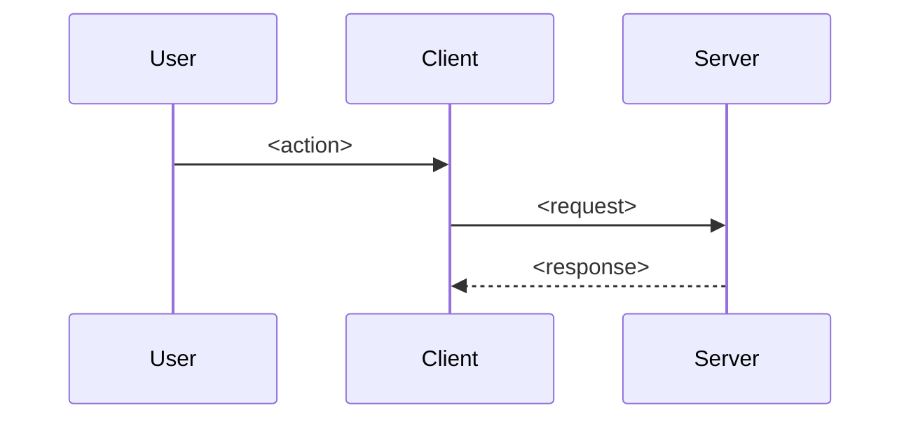
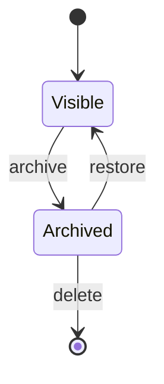

# Documentation Templates

Budgets and rules are in [SKILL.md](../SKILL.md). Every path in a template is a placeholder; cite only paths that exist.

## Master Index

`docs/INDEX.md` — the entry point.

```markdown
# {Project Name} Documentation

<two sentences: what the project is and who it is for. The code is the source of truth; docs describe the present state at concept level.>

## Tech Stack

- **Framework**: <e.g. Phoenix / Elixir>
- **Database**: <e.g. PostgreSQL>
- **Other**: <only what shapes the architecture>

## Features

| Feature | Description |
|---------|-------------|
| [<Feature>](features/feature-name/INDEX.md) | <one line> |

## Quick Links

- [CONTEXT.md](CONTEXT.md) — ubiquitous language
- [Testing](testing.md) *(if it exists)*
```

---

## Feature Index

`docs/features/{feature-name}/INDEX.md` — ≤ 12 lines.

```markdown
# {Feature Name}

<one paragraph: what the feature does and for whom.>

## Documents

| Document | Purpose |
|----------|---------|
| [DESIGN.md](DESIGN.md) | <what this feature's design page covers> |
| [TECHNICAL.md](TECHNICAL.md) | <architecture, where things live, the non-obvious> |
| [FLOW.mermaid](FLOW.mermaid) | <what the diagram shows> *(if it exists)* |
| [<topic>.md](<topic>.md) | <sub-component> *(if it exists)* |
```

---

## Project Context

`docs/CONTEXT.md` — the ubiquitous language. This exact filename.

```markdown
# {Project Name} — Context

The ubiquitous language used across {Project}. Definitions are one sentence — what a term *is*, not what it does. The canonical name is bolded; rejected synonyms sit under `_Avoid_`.

## <Area>

**Order**:
A confirmed customer request for goods or services.
_Avoid_: purchase, transaction

**Invoice**:
A request for payment sent to a customer after delivery.
_Avoid_: bill, payment request

## Relationships

- An **Order** produces one or more **Invoices**.
- An **Invoice** belongs to exactly one **Customer**.

## Flagged ambiguities

- <a word used for two concepts, and how it was resolved — only while migrating>
```

Group terms under area headings once there are more than a dozen. Domain terms only.

---

## Feature Context

`docs/features/{feature-name}/CONTEXT.md` — optional; only for terms that never leave the feature. Same shape as the project file. A term that appears outside the feature moves to `docs/CONTEXT.md`.

---

## Design

`docs/features/{feature-name}/DESIGN.md` — 30–70 lines. The functional overview in user-level vocabulary; no source files or code identifiers beyond routes and header names.

```markdown
# {Feature Name} — Design

## Overview

<one paragraph: what it does, for whom, and the one idea that shapes it.>

## Surface

- **<Element>** — <what the user sees and can do with it.>

## Flows

- **<Flow>** — <what happens, in a sentence or two.>

## Decisions

- **<Decision>** — <the reason, one or two sentences.>
```

Sections are a guide: an API feature swaps Surface for a headers table, an endpoint table and an error contract; a lifecycle feature adds a Lifecycle section and a state diagram.

---

## Technical

`docs/features/{feature-name}/TECHNICAL.md` — 40–90 lines. Point at the code by path; cache only what the code cannot confess.

```markdown
# {Feature Name} — Technical

## Architecture

<one or two paragraphs: the layers involved, how a request or event flows through them, and where ownership and permission are enforced.>

## Where things live

| File | Role |
|------|------|
| `lib/my_app/foo.ex` | <one line> |
| `lib/my_app_web/live/foo_live.ex` | <one line> |
| `assets/js/hooks/foo_hook.js` | <one line> |

## Noteworthy

### <A contract or invariant>

<one to four sentences: the rule and the reason. Ordering invariants, race outcomes, optimistic-UI contracts, security gates, constants mirrored across layers, deliberate choices a reader would otherwise "fix".>
```

A data-model paragraph goes under Architecture only when a constraint, index or nullable semantic is load-bearing; it points at the schema file rather than repeating it. When nothing is non-obvious, Noteworthy is short or absent.

---

## Flow Diagram

`docs/features/{feature-name}/FLOW.mermaid` — one diagram at protocol level: participants and messages, or states and transitions. Internal module and function names stay out.


```mermaid
sequenceDiagram
    participant U as User
    participant C as Client
    participant S as Server

    U->>C: <action>
    C->>S: <request>
    S-->>C: <response>
```


```mermaid
stateDiagram-v2
    [*] --> Visible
    Visible --> Archived: archive
    Archived --> Visible: restore
    Archived --> [*]: delete
```

---

## Sub-component

`docs/features/{feature-name}/{topic}.md` — for a sub-system that would push TECHNICAL past budget and only matters for specific tasks.

```markdown
# {Feature Name} — {Topic}

## Overview

<what it is and why it is documented apart.>

## Noteworthy

<same rules as TECHNICAL: point at files, cache the non-obvious.>

## Integration

<how it connects to the parent feature.>
```
